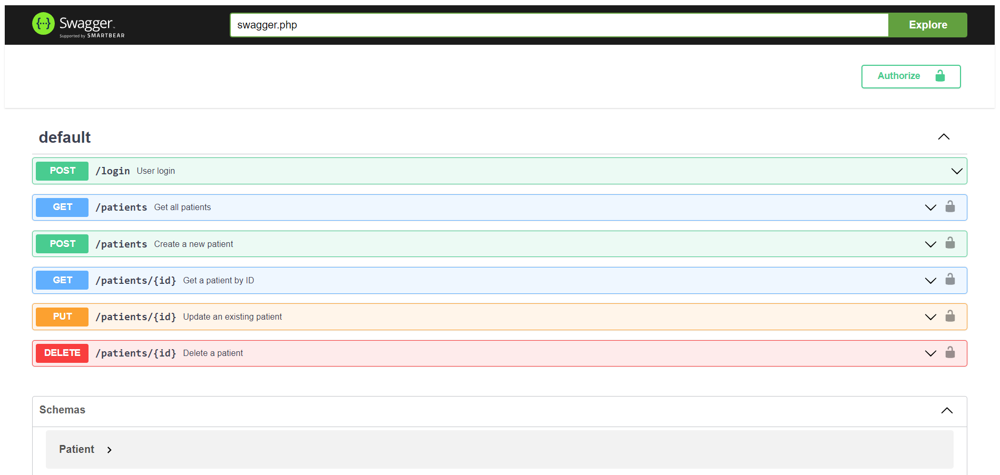
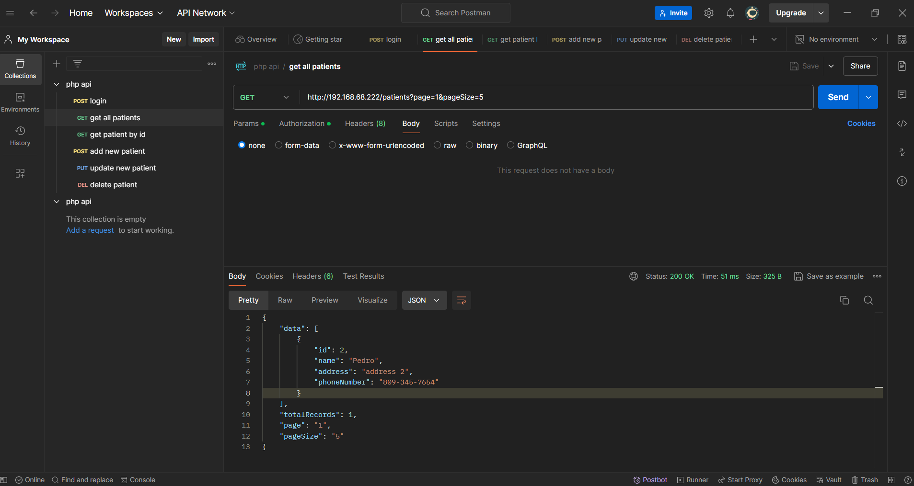

# PHPHospitalSystemAPI
Example of PHP 7 RESTful API 

This is a RESTful API built using the [Slim Framework](https://www.slimframework.com/) with JWT authentication. It includes endpoints for user login, patient management, and utilizes [OpenAPI](https://swagger.io/specification/) to generate documentation.

## Features

- **JWT Authentication**: Secure API routes with JSON Web Tokens.
- **CRUD Operations**: Manage patients with create, read, update, and delete (CRUD) functionality.
- **OpenAPI Documentation**: Automatically generate OpenAPI (Swagger) documentation from annotations in your code.
- **PSR-7**: Compliant with PSR-7 standards for HTTP messages.
- **Unit Testing**: Test coverage using PHPUnit.

## Requirements

- PHP 7.2 or higher
- Composer
- Slim Framework 4
- Firebase JWT
- Swagger PHP
- PHPUnit
- MySQL

## Installation

Run the SQL script in MySql and run this command in linux: 

```
composer install
```

### Steps to Remove `index.php` from URLs

1. **Create a `.htaccess` file** inside the API directory of your project. If the file already exists, modify it as follows:

2. Add the following rules to the .htaccess file to enable URL rewriting:

```
# Use mod_rewrite to remove index.php from URLs

<IfModule mod_rewrite.c>
    RewriteEngine On
    
    # Conditionally redirect if index.php is in the URL
    RewriteCond %{REQUEST_FILENAME} !-f
    RewriteCond %{REQUEST_FILENAME} !-d
    
    # Rewrite to remove index.php
    RewriteRule ^ index.php [QSA,L]
</IfModule>
```

3. Ensure mod_rewrite is enabled on your Apache server. You can enable it by running the following command:

```
sudo a2enmod rewrite
```

## Images




